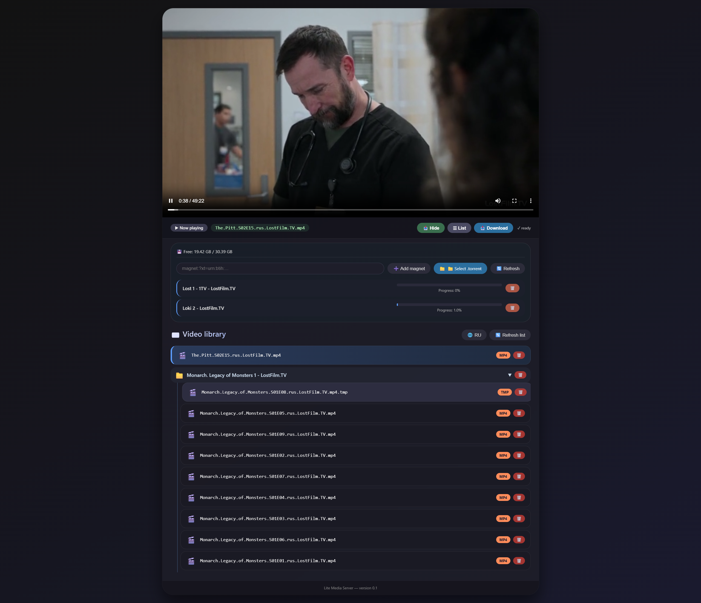
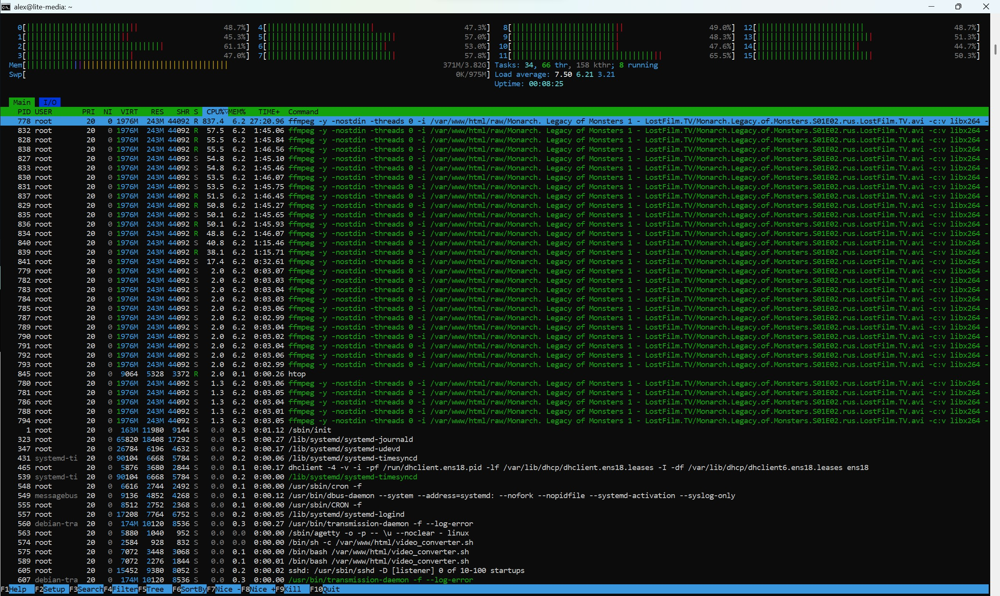

# Lite Media Server

**Lite Media Server** – a cross-platform video player with folder grouping, Transmission torrent integration (magnet/.torrent, progress, disk space), file/folder deletion, and multilingual UI (RU/EN). Plays MP4 natively, offers download for unsupported formats like AVI (converted via ffmpeg).

## Supported formats

**mp4, m4v, mov, webm, ogg, ogv**

If a format is not supported, the server will automatically attempt to convert it to mp4 using `ffmpeg`.  
⚠️ **Disclaimer**: conversion speed heavily depends on CPU frequency and core count.

## Screenshots

| Main interface | System monitoring (htop) |
|----------------|---------------------------|
|  |  |

## Installation (tested on Debian 12)

All commands must be run as **root** (or with `sudo`).

1. **Become root**
   ```bash
   su
   ```

2. **Update repositories and install updates (optional but recommended)**
   ```bash
   apt update
   apt upgrade -y
   ```

3. **Install required packages**
   ```bash
   apt install sudo apache2 ffmpeg php php-curl php-cli libapache2-mod-php php-mysql htop transmission-common transmission-daemon git -y
   ```

4. **Restart Apache (optional, full restart)**
   ```bash
   systemctl restart apache2
   ```

5. **Clone the project**
   ```bash
   git clone https://github.com/TaidremRU/lite-media-server.git
   ```

6. **Move project to web root**
   ```bash
   cd lite-media-server/
   rm raw/add.txt
   rm transmission/add.txt
   rm video/add.txt
   mv * /var/www/html/
   cd /var/www/html/
   ```

7. **Remove default index.html**
   ```bash
   rm /var/www/html/index.html
   ```

8. **Set correct permissions**
   ```bash
   chown www-data:www-data /var/www/html/* -R
   chmod +x /var/www/html/video_converter.sh
   chown -R debian-transmission:debian-transmission /var/www/html/transmission
   chown -R debian-transmission:debian-transmission /var/www/html/raw
   chmod 755 /var/www/html/remove_completed.sh
   chmod 777 /var/www/html/remove.php
   ```

9. **Stop transmission daemon**
   ```bash
   sudo service transmission-daemon stop
   ```

10. **Edit Transmission settings**
   ```bash
   nano /etc/transmission-daemon/settings.json
   ```

   **Set the following values (adjust as needed):**
   ```json
   "download-dir": "/var/www/html/raw"
   "incomplete-dir": "/var/www/html/transmission"
   "incomplete-dir-enabled": true
   "rpc-password": "lite"
   "rpc-username": "media"
   "script-torrent-done-enabled": true
   "script-torrent-done-filename": "/var/www/html/remove_completed.sh"
   ```

11. **Start transmission daemon**
   ```bash
   sudo service transmission-daemon start
   ```

12. **Add conversion script to crontab (run at boot)**
   ```bash
   crontab -e
   Add this line:
   @reboot /var/www/html/video_converter.sh
   ```

13. **Reboot the machine**
   ```bash
   sudo shutdown -r now
   ```

After reboot, the server is ready. Open your browser and navigate to `http://your-server-ip/`

## Usage

- Browse folders and play MP4 videos.
- For unsupported formats (AVI, etc.), the server offers a download link after conversion.
- Add torrents (magnet or .torrent) – Transmission handles downloads, progress, and disk space.
- Delete files/folders via the UI.

Default Transmission RPC credentials:
Username: `media`
Password: `lite`

## Notes & Recommendations

- The conversion script (`video_converter.sh`) runs at boot and monitors new files in the `raw` directory.
- Make sure `ffmpeg` is installed – it is included in the dependency list.
- If you change the Transmission password, update `rpc-password` in settings.json (stop the daemon first, edit, then start).

## Troubleshooting

Problem: `ffmpeg` not found
Solution: Reinstall with `apt install ffmpeg --reinstall`

Problem: Permission denied on `raw` or `transmission`
Solution: Run `chown -R debian-transmission:debian-transmission /var/www/html/raw /var/www/html/transmission`

Problem: Conversion not starting after reboot
Solution: Check crontab with `crontab -l`. Ensure `video_converter.sh` is executable (`chmod +x`).

Problem: Web UI shows 403
Solution: Fix Apache permissions: `chown www-data:www-data /var/www/html -R`

## License

This project is open source. You may use, modify, and distribute it under the terms of the MIT License.

## Author

TaidremRU
Project repository: https://github.com/TaidremRU/lite-media-server